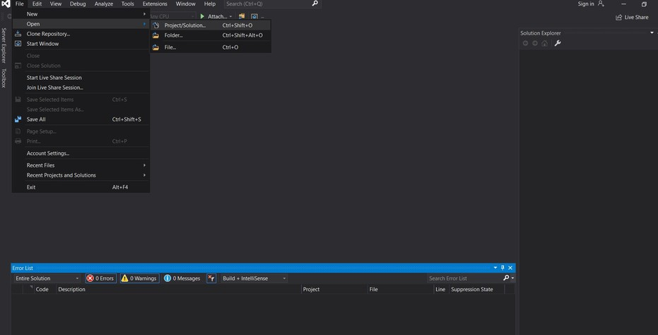
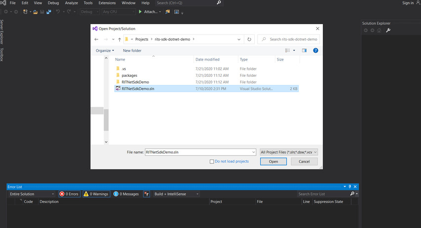
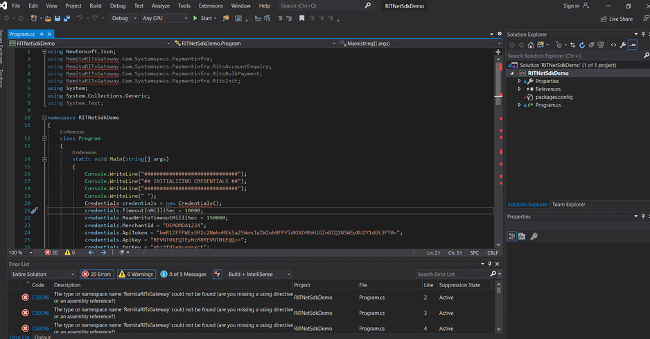
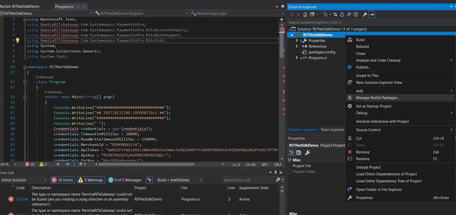
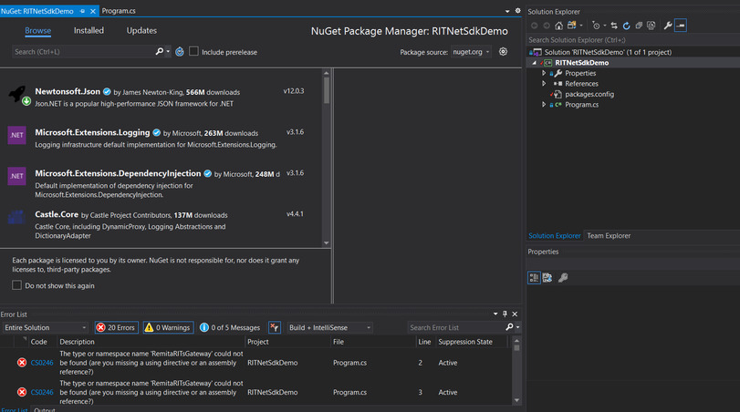
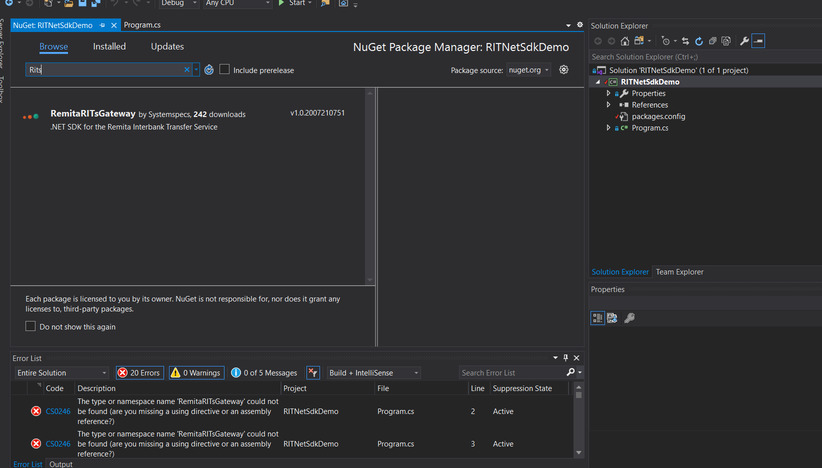
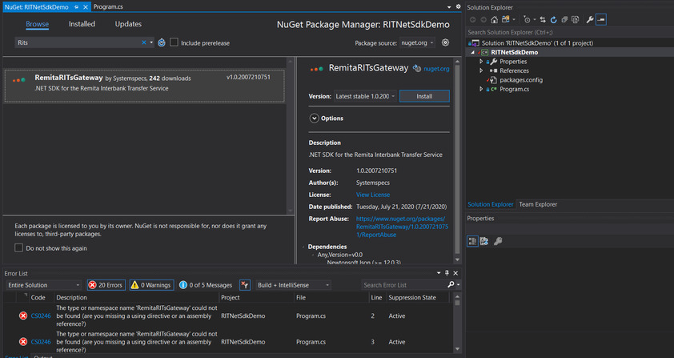
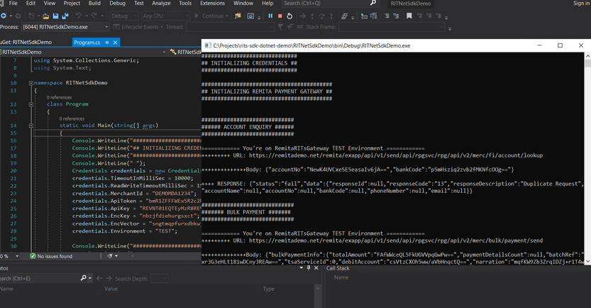

# RITs .Net SDK Demo
A sample C# Console app to demo RITS SDK

## Installation
The following screenshots outlines the steps to installing RITs Nuget(SDK) to the Demo app.

Note: This setup is done with Microsoft Visual Studio 2019

### Step 1

### Step 2

### Step 3

### Step 4

### Step 5

### Step 6

### Step 7

### Step 8

