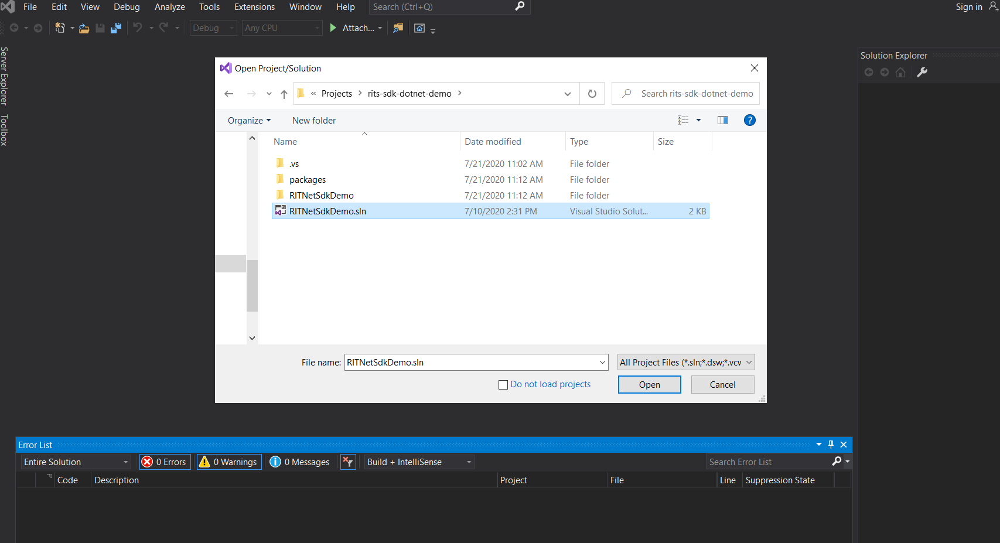
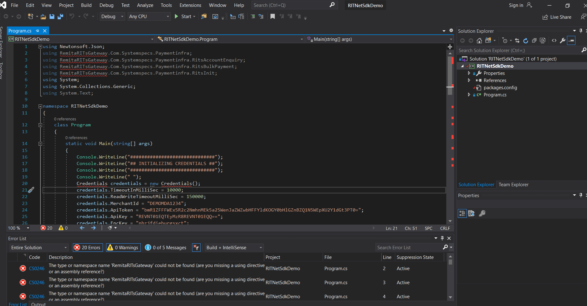
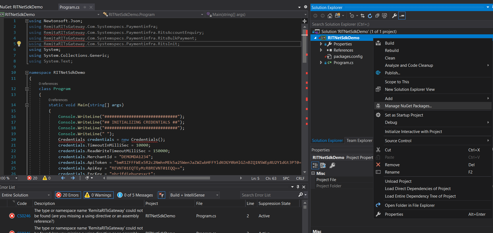
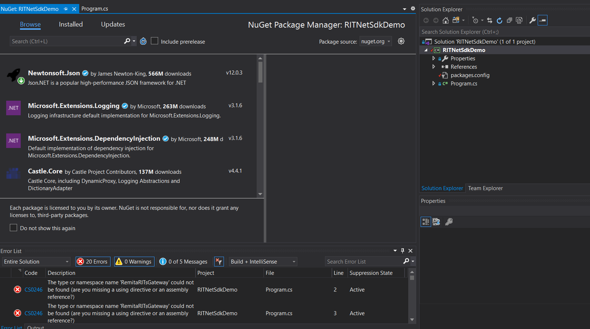
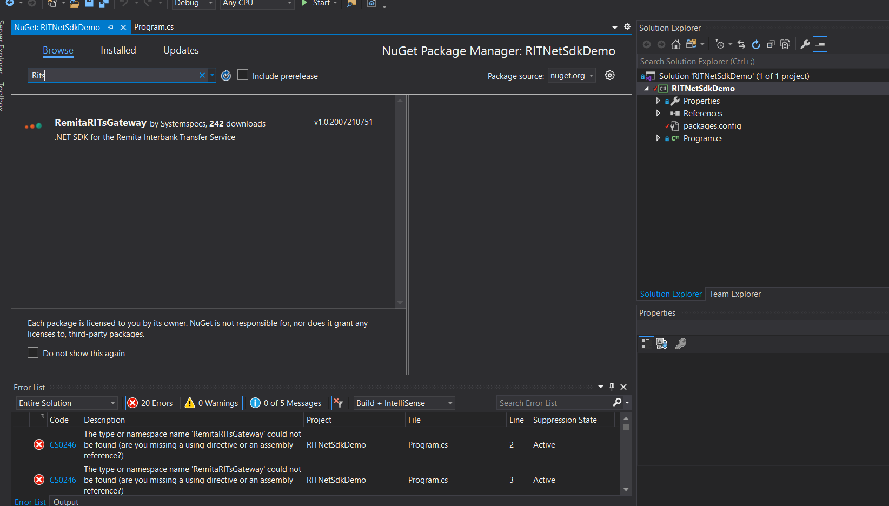
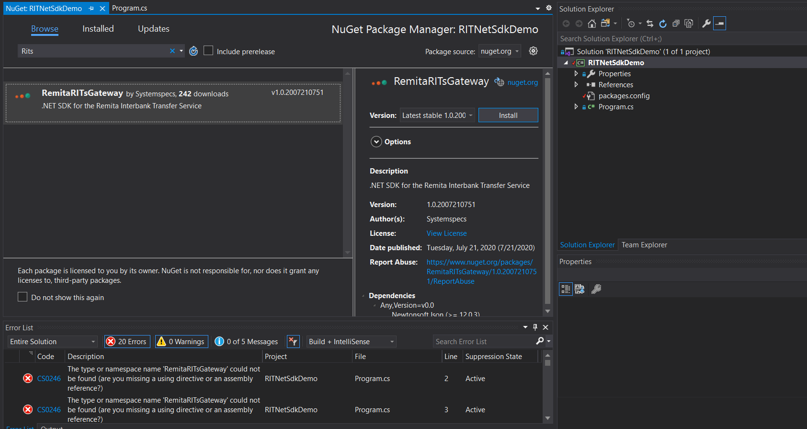
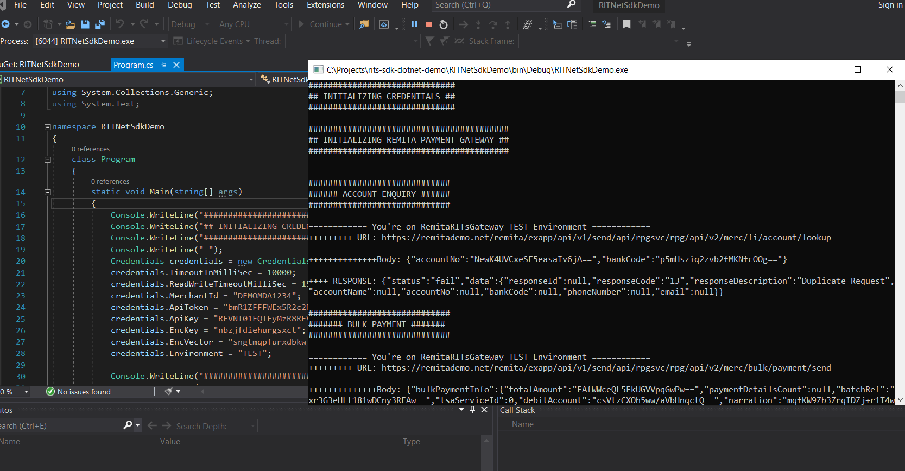

# RITs .Net SDK Demo
A sample C# Console app to demo RITS SDK

## Installation
All merchant credentials needed to use RITs are being setup by instantiating the Credential Class and set the properties 
in this class accordingly. Properties such as MerchantId, ApiKey, ApiToken, Key, Iv and the Environment needs to be set.
 
_Note:_ Environment can either be TEST or LIVE, each of this environment has it respective Credential. Ensure you set the 
right credentials. By default Environment is TEST

